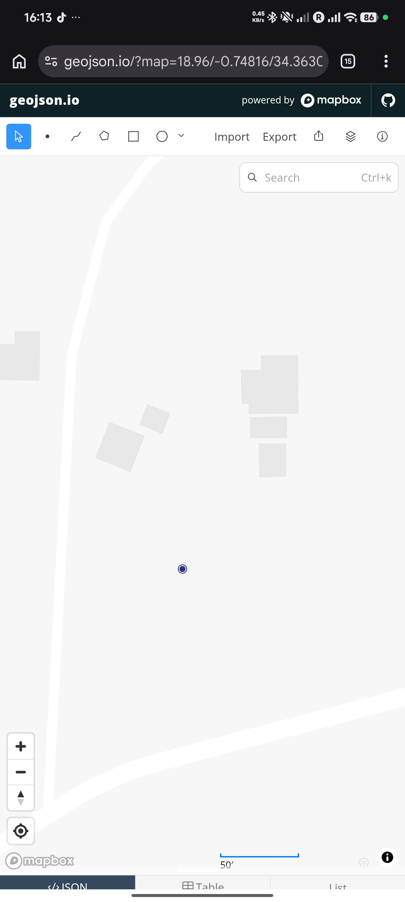

# Smart Farm Kanyidoto

A GIS and smart agriculture project focused on farm planning in Kanyidoto East, Homa Bay County, Kenya.

## Project Goal

To explore how GIS, agricultural data, and simple smart-farming methods can improve planning and decision-making on a small farm.

## Main Objectives

- Map the farm area
- Identify possible crop zones
- Plan soil sampling locations
- Identify water and irrigation opportunities
- Organize farm data
- Build a simple digital farm plan

## Tools

- GitHub
- QGIS
- OpenStreetMap
- Google Maps
- Spreadsheet tools

## Project Status

Planning stage

## GIS Map

The map below shows the current farm reference point in Kanyidoto East, Homa Bay County, Kenya.

